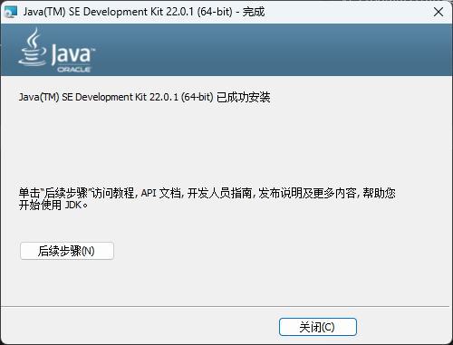
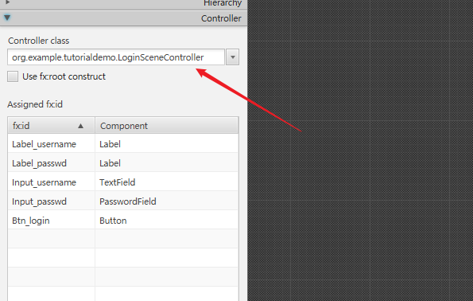
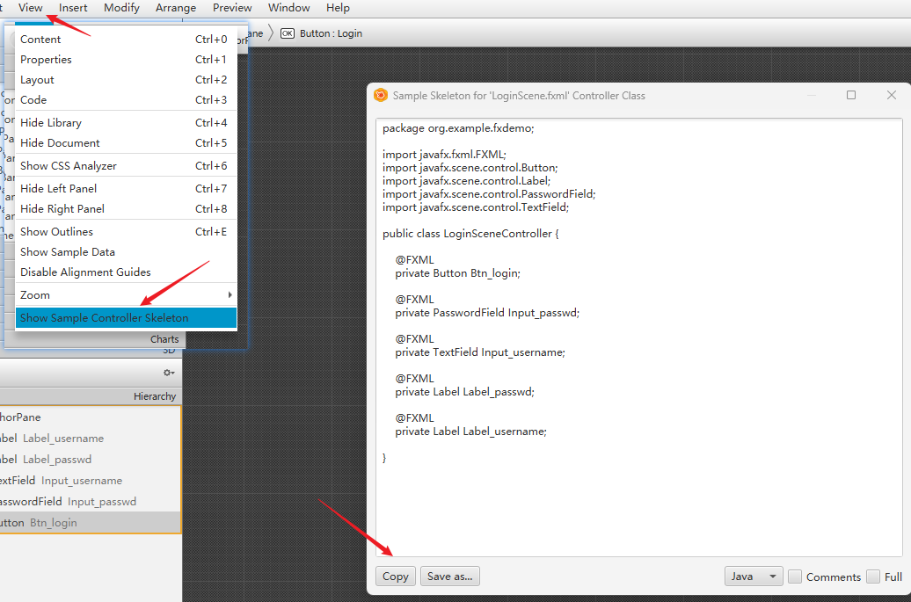

---
html:
    toc: true
    toc_float: true
---
@import "./Introduction_Project_JavaFx/vue.css"
# JavaFx的简单教程

## 介绍
欢迎来到JavaFX项目文档！本文档旨在帮助新学习Java的同学们利用JavaFX完成简单GUI的绘制。JavaFX作为Java平台的一部分，提供了强大而灵活的工具，可用于创建各种交互式用户界面。

在本文档中，我们将介绍如何使用JavaFX构建简单的GUI，你将学会如何使用JavaFX的各种功能来设计界面、处理用户输入、处理逻辑等。

### 什么是JavaFX
JavaFX 是一个<a href="https://openjfx.io/" target="_blank">开源</a>的下一代客户端应用程序平台，适用于基于 Java 构建的桌面、移动和嵌入式系统。这是许多个人和公司的协作努力，目标是为开发富客户端应用程序生成一个现代、高效且功能齐全的工具包。

### JavaFX的优势

1. **跨平台兼容性**：JavaFX应用程序可以在多种平台上运行，包括Windows、Mac OS、Linux和嵌入式系统。

2. **富客户端功能**：JavaFX提供了大量的图形和媒体API，包括2D和3D图形、图像处理、音频和视频播放等。

3. **FXML和CSS支持**：JavaFX支持FXML，这是一种基于XML的声明式语言，用于定义用户界面。JavaFX也支持CSS，可以用来定制应用程序的外观。

4. **硬件加速**：JavaFX支持硬件加速，可以提高图形渲染的性能。

5. **集成开发环境（IDE）支持**：JavaFX与主流的Java IDE（如Eclipse、IntelliJ IDEA和NetBeans）兼容，可以方便地创建和管理JavaFX项目。

### JavaFX与Swing的比较

虽然Swing也是一个用于创建图形用户界面的Java库，但JavaFX提供了许多Swing所没有的功能和优势。

1. **现代化的用户界面**：JavaFX提供了更现代化的用户界面组件，以及2D和3D图形、动画和Web视图等功能。

2. **更好的性能**：JavaFX支持硬件加速，可以提高图形渲染的性能。而Swing则依赖于Java 2D API，其性能较低。

3. **更强的样式支持**：JavaFX支持CSS，可以用来定制应用程序的外观。而Swing的样式定制能力较弱。

4. **FXML支持**：JavaFX支持FXML，可以用于声明性地定义用户界面。而Swing则需要通过代码来创建和修改界面。

总的来说，JavaFX是一个强大且灵活的平台，适合用于创建现代化的、富有吸引力的桌面应用程序。

### 一些使用JavaFX构建的工具和框架


## 开发环境设置
### Java环境配置
1. 打开Oracle官网,下载合适的JDK。<a href="https://www.oracle.com/java/technologies/downloads/" target="_blank">https://www.oracle.com/java/technologies/downloads</a>


2. 选择合适的JDK下载，这里以Windows JDK-22为例。

3. 安装



4. 验证是否安装成功：打开**cmd**，输入``java -version``，出现图中信息即表示安装成功。

### IDEA安装
1. 打开jetbrains官网，下载**Community**社区版Intellij IDEA。<a href="https://www.jetbrains.com/zh-cn/idea/download/" target="_blank">https://www.jetbrains.com/zh-cn/idea/download/</a>

2. 下载好的安装包。

3. 正常安装即可。


### Scene Builder安装
1. 前往Scene Builder开源仓库或者官方网站下载。
    <a href="https://github.com/gluonhq/scenebuilder/releases/latest" target="_blank">开源仓库：https://github.com/gluonhq/scenebuilder/releases/latest</a>
    <a href="https://gluonhq.com/products/scene-builder/" target="_blank">官网地址：https://gluonhq.com/products/scene-builder/</a>


2. 成功安装。

### IDEA与Scene Builder绑定
1. 打开IDEA，新建一个JavaFX项目


2. ``CRTL + ALT + S``快速打开设置菜单，搜索``JavaFX``，在框内设置Scene Builder本体的路径。

### Hello JavaFX
1. 到此，你应该成功创建了一个JavaFX项目并且配置好了环境。接下来，运行``HelloApplication.java``，你就能看到一个初始的界面了。

2. 这个界面包含一个简单的按钮，按下后显示``Welcome to JavaFX Application!``。


## JavaFX的结构与基本组件
> 部分内容翻译自 https://www.javatpoint.com/javafx-application-structure

JavaFX应用程序按层次划分为三个主要组件，即Stage、Scene和节点。我们需要在每个JavaFX应用程序中导入**javafx.application.Application**类。它为JavaFX应用程序提供以下生命周期方法：

```java
public void init()
public abstract void start(Stage primaryStage)
public void stop()
```

为了创建一个基本的JavaFX应用程序，我们需要：

1. 将**javafx.application.Application**导入到我们的代码中。
2. 让我们的类继承**Application**。
3. 重写Application类的**start()**方法。

### Stage

JavaFX应用程序中的**Stage**类似于Swing应用程序中的**Frame**。它充当所有JavaFX对象的容器。主要的Stage由平台内部创建。应用程序可以进一步创建其他的Stage。主要的Stage对象被传递给**start**方法。我们需要在主要的Stage对象上调用**show**方法，以显示我们的**primary stage**。最初，主要的Stage如下所示。


然而，我们可以向这个主要的Stage添加各种对象。这些对象只能以分层的方式添加，即首先将场景图添加到这个主要的Stage，然后该场景图可能包含节点。节点可能是用户界面的任何对象，如文本区域、按钮、形状、媒体等。

### Scene

Scene实际上包含了JavaFX应用程序的所有物理内容（节点）。**Javafx.scene.Scene**类提供了处理场景对象的所有方法。创建场景是为了在Stage上可视化内容的必要条件。

在一个实例中，Scene对象只能被添加到一个Stage。为了在我们的JavaFX应用程序中实现Scene，我们必须在我们的代码中导入**javafx.scene**包。**Scene**可以通过创建**Scene类对象**并将布局对象传递给Scene类构造函数来创建。我们将在后面详细讨论Scene类及其方法。

### Scene Graph

Scene Graph位于层次结构的最低层。它可以被看作是各种节点的集合。节点是在Stage上可视化的元素。它可以是任何按钮、文本框、布局、图像、单选按钮、复选框等。

节点以树的形式实现。场景图中总是有一个根。这将作为场景图中所有其他节点的父节点。然而，这个节点可能是JavaFX系统中可用的任何布局。

叶节点存在于树层次结构的最低层。场景图中存在的每个节点都代表javafx.scene包的类，因此我们需要将该包导入到我们的应用程序中，以创建一个功能齐全的javafx应用程序。


### 常见的UI组件

- **Button**：按钮，用户可以点击触发事件。
- **Label**：标签，用于显示文本信息。
- **TextField**：文本字段，允许用户输入一行文本。
- **TextArea**：文本区域，允许用户输入多行文本。
- **PasswordField**：密码输入框，允许用户以非显式输入文本。
- **CheckBox**：复选框，允许用户选择或取消选择单个值。
- **RadioButton**：单选按钮，通常用于一组选项中选择一个。
- **ComboBox**：组合框，允许用户从下拉列表中选择一个选项。
- **ListView**：列表视图，显示一列可选择的项。
- **TableView**：表格视图，用于显示和编辑二维数据。

这些基本组件和布局容器是构建JavaFX应用的基石，通过组合和配置这些元素，开发者可以创建出功能丰富、响应式良好的图形用户界面。

## FXML与Controller

JavaFX提供了FXML和Controller机制，用于更好地组织和管理UI代码。FXML用于声明性地定义用户界面，而Controller用于处理用户界面的逻辑。

### FXML简介

FXML是一种基于XML的声明式标记语言，用于描述JavaFX应用程序的用户界面。FXML可以使我们的应用程序更易于维护和修改，因为它将UI布局从应用程序逻辑中分离出来。

FXML文件通常用于定义界面的布局和元素（如按钮、文本框等）。这些元素可以通过FXML标签来定义，其属性可以通过标签属性来设置。例如，一个简单的FXML文件可能会定义一个包含一个按钮和一个标签的场景。

FXML文件可以通过`FXMLLoader`类加载，该类会根据FXML文件创建一个场景图（scene graph）的对象结构。

以下是一个简单的FXML文件示例：

```xml
<?xml version="1.0" encoding="UTF-8"?>

<?import javafx.geometry.Insets?>
<?import javafx.scene.control.Label?>
<?import javafx.scene.layout.VBox?>

<?import javafx.scene.control.Button?>
<VBox alignment="CENTER" spacing="20.0" xmlns:fx="http://javafx.com/fxml"
      fx:controller="org.example.tutorialdemo.HelloController">
    <padding>
        <Insets bottom="20.0" left="20.0" right="20.0" top="20.0"/>
    </padding>

    <Label fx:id="welcomeText"/>
    <Button text="Hello!" onAction="#onHelloButtonClick"/>
</VBox>
```

### Controller简介

Controller是一个普通的Java类，它被用来处理用户界面的交互逻辑。每个FXML文件通常都有一个关联的Controller类。Controller类中的方法可以被FXML文件中的UI元素调用，以响应用户的操作。

在FXML文件中，可以通过`fx:controller`属性来指定关联的Controller类。然后，可以使用`fx:id`属性在Controller类中引用FXML文件中的元素。

Controller类中的方法和字段需要使用`@FXML`注解，以便FXML加载器可以访问它们。例如，如果我们有一个按钮需要在被点击时执行某些操作，我们可以在Controller类中定义一个处理方法，并使用`@FXML`注解。

以下是一个简单的Controller类示例：

```java
package org.example.tutorialdemo;

import javafx.fxml.FXML;
import javafx.scene.control.Label;

public class HelloController {
    @FXML
    private Label welcomeText;

    @FXML
    protected void onHelloButtonClick() {
        welcomeText.setText("Welcome to JavaFX Application!");
    }
}
```

在这个示例中，`onHelloButtonClick`方法将在`Button`被点击时被调用，它将改变`welcomeText`的文本。

### 使用 Scene Builder 编辑FXML
#### Scene Builder 界面
0. 界面介绍

Scene Builder 的界面可以简单分为几个个区域：
> 1. **菜单栏（Menu Bar）**：位于窗口顶部，提供了许多菜单选项，包括文件操作（新建、打开、保存等）、编辑操作（撤销、重做、剪切、复制、粘贴等）、视图选项（显示或隐藏特定的面板）、工具选项（配置和插件等）以及帮助选项（文档和关于信息等）。
> 2. **库面板（Library Panel）**：通常位于左侧，包含了所有可用的UI组件，如容器、控件、菜单、形状、图表等。你可以通过拖放这些组件到中心的布局面板来构建你的界面。
> 3. **布局面板（Layout Panel）**：位于中心，显示了FXML文件当前的视觉结构。这里你可以直接看到你的界面布局，并可以通过拖放组件进行编辑。
> 4. **属性面板（Properties Panel）**：通常位于右侧，提供了对选中组件的详细属性设置，如大小、颜色、字体、对齐方式等。属性面板允许你细致地调整和设置组件的各种属性。
> 5. **层次结构面板（Hierarchy Panel）**：也常位于左侧，显示了界面组件的层次结构，形成了一个树状图。这个面板允许你查看和编辑组件的父子关系，以及选择特定的组件进行编辑。
> 6. **代码面板（Code Panel）**：也通常位于右侧，这里你可以为选中的组件设置ID，以便在JavaFX应用程序的控制器类中引用，同时可以为组件指定事件处理方法，这些方法需要在相应的控制器类中实现。


通过这些区域的相互协作，你可以轻松地构建和编辑JavaFX界面，同时将其与后端代码紧密集成。
#### 创建一个简单的界面
接下来，我们来创建一个简单的登录界面。

1. 我们先来新建一个空白的界面


2. 拖入一个`AnchorPane`


3. 拖入`Label`,`TextField`,`PasswordField`和`Button`控件，我们来创建一个简单的登录界面。


4. 选择对应的控件后，在`控制`一栏中可以自由编辑一些关于控件的内容。


5. 这样，我们简单的界面已经画好了！接下来，按下`CTRL + P`预览一下叭。


6. 给控件赋予`fx:id`


7. 不要忘记保存文件。


#### 绑定控制类

1. 创建对应控制类


2. 在`Scene Builder`中绑定对应控制类，注意路径写法。


3. 在`Scene Builder`中复制骨架代码粘贴到控制类中。


4. 至此，控制类绑定完成。


## 事件处理

在JavaFX中，事件处理是响应用户交互的关键机制。用户的动作，如点击按钮、输入文本、移动鼠标等，都会产生事件。JavaFX提供了一套丰富的框架来监听和响应这些事件。

### 事件类型

JavaFX有多种类型的事件，每种事件都对应用户或程序的特定交互。以下是一些常见的事件类型：

- **Action Events**：当用户执行确定的动作时触发，例如点击按钮。
- **Mouse Events**：与鼠标交互相关的事件，如点击、拖拽、移动、进入或离开组件的区域。
- **Key Events**：与键盘交互相关，如按键按下、释放或敲击键盘。
- **Window Events**：与窗口状态相关的事件，如打开、关闭、最小化或最大化窗口。
- **Input Events**：是鼠标和键盘事件的父类，包括任何由用户输入设备产生的事件。

### 添加事件处理方法

1. 这里以一个简单的登录判断为例，先选中`Button`控件，在`Code Panel`中找到`OnMouseReleased`，填上控制方法名。


2. 在控制类中写上对应的控制方法。
```java
@FXML
void LoginBtnReleased() {

}
```

3. 写一个简单的登录验证。
```java
@FXML
void LoginBtnReleased() {
    String username = Input_username.getText();
    String passwd = Input_passwd.getText();
    if (username.equals("admin") && passwd.equals("admin")) {//判断用户名密码是否为某个值
        //弹出一个对话框
        Alert alert = new Alert(Alert.AlertType.INFORMATION);
        alert.setTitle("提示");
        alert.setHeaderText("登录成功");
        alert.setContentText("登录成功");
        alert.showAndWait();
    } else {
        //弹出一个对话框
        Alert alert = new Alert(Alert.AlertType.ERROR);
        alert.setTitle("提示");
        alert.setHeaderText("登录失败");
        alert.setContentText("登录失败");
        alert.showAndWait();
    }
}

```

4. 效果如下。


## 一些可能遇到的问题
### 控制类的位置怎么确定？

在JavaFX中，控制类（Controller Class）通常与FXML文件关联，用于处理用户界面的事件和逻辑。控制类的位置通常由项目的包结构决定，它应该位于源代码（src）目录下的适当包路径中。

为了在FXML文件中引用控制类，你需要在FXML文件的顶部通过`fx:controller`属性指定控制类的完整路径，例如：

```xml
<AnchorPane xmlns:fx="http://javafx.com/fxml" fx:controller="com.example.MyController">
    <!-- UI elements here -->
</AnchorPane>
```

在这个例子中，`MyController`是控制类的名称，而`com.example`是包名。

### 如何切换场景Scene？
下面是一个监听事件，当按钮按下时跳转到`OtherPage.fxml`对应的界面。
```
//文件路径如下
src
└───resources
    └───foo
        └───bar
            └───OtherPage.fxml
```
```java
@FXML
void btnClick() throws IOException {
    Stage primaryStage = (Stage) welcomeText.getScene().getWindow();// 此处的welcomeText 为当前场景中任意一个控件实例
    //加载fxml文件，注意此处的文件路径为相对于 /src/resources/ 下的，写法为 /foo/bar/filename.fxml
    URL url = getClass().getResource("OtherPage.fxml");
    //加载完fxml文件后，获取其中的root
    Parent root = FXMLLoader.load(Objects.requireNonNull(url));
    //设置场景
    Scene scene = new Scene(root);
    primaryStage.setScene(scene);
}
```

## 资源
<a href="https://ant.design/docs/spec/introduce-cn" target="_blank">Ant Design 设计规范</a>
<a href="https://developers.weixin.qq.com/miniprogram/design/" target="_blank">微信小程序设计规范</a>
<a href="https://www.javatpoint.com/javafx-tutorial" target="_blank">javatpoint.com - javafx-tutorial</a>
